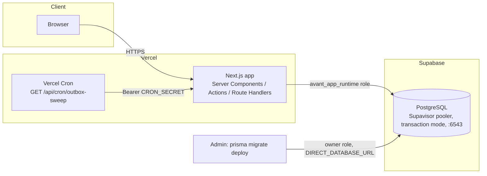

# Production Deployment Guide

Concise, current, deployer-facing guide. Written in P4.1 (Commercial Deployment Readiness) as the single canonical reference for taking this application to production. [DEPLOYMENT.md](../DEPLOYMENT.md) at the repo root remains the deeper historical record (the real Supabase transaction-pooler outage, the runtime-role-grant regression, the Vercel Hobby cron rejection) — read it once for the "why," come back here for the "how" each time you actually deploy. No secrets appear in either document.

**This document covers the first-time production setup.** For every release/upgrade *after* that — the recurring, day-to-day operation this whole project exists to support long-term — see [RELEASE_CHECKLIST.md](RELEASE_CHECKLIST.md), [RELEASE_RUNBOOK.md](RELEASE_RUNBOOK.md), and [DATABASE_MIGRATION_SAFETY.md](DATABASE_MIGRATION_SAFETY.md) (P4.8), which build on the Migrations/Rollback/Smoke Test sections below rather than replacing them.

## 1. Architecture at a Glance



One Next.js application, one PostgreSQL database, multiple organizations in one schema (multi-tenant-in-one-database — see §11). No separate worker process, no message queue, no Docker image for the app itself (see §10 for why).

## 2. Environment Variables

| Variable | Required | Read by | Notes |
|---|---|---|---|
| `DATABASE_URL` | Yes | Application runtime (`src/lib/db.ts`) | The restricted `avant_app_runtime` role. **Must** use Supabase's Supavisor pooler in **transaction mode** (`:6543`, `?pgbouncer=true`) in any deployed environment — session mode caused a real production outage (`EMAXCONNSESSION`), see DEPLOYMENT.md. |
| `DIRECT_DATABASE_URL` | Yes (CLI only) | `prisma.config.ts` — migrations/`db seed` only | The schema-owner role. Never used by the running application. |
| `NODE_ENV` | Yes | Cookie `secure` flag, Next's own build mode | `production` in every deployed environment. |
| `CRON_SECRET` | Recommended | `/api/cron/outbox-sweep` | Bearer token the scheduler must present. Route returns `503` (refuses to run) rather than executing unauthenticated if unset — there is no "open" fallback. |
| `OUTBOX_PROCESSING_TIMEOUT_MS` | No | `src/lib/platform/outbox.ts` | Default `300000` (5 min). Only set if a real deployment's handlers are legitimately slower. |
| `APP_BASE_URL` | Recommended once a real email/SMS provider is connected | `requestPasswordReset` (`src/lib/auth/service.ts`) | Full origin, e.g. `https://app.example.com` — new in P4.1, see §7 below. Nothing breaks without it; links just stay relative (fine while every provider is still a `Null*Adapter`). |
| `SUPER_ADMIN_BOOTSTRAP_PASSWORD` | No | `prisma/seed.ts` | New in P4.1 — set this to inject a known password (e.g. from your own secret manager) for the seeded Super Admin instead of the auto-generated one printed to the seed run's own console output. See §9. |
| `TEST_DATABASE_URL` / `TEST_DIRECT_DATABASE_URL` | Local/CI only | `test/setup-test-database.ts` | **Never set in a deployed environment.** The integration suite refuses to run against anything that looks like Supabase/a remote host even if these were accidentally set. |

**Dead/unused — do not set these expecting them to do anything**: `SESSION_SECRET` (session/reset tokens are raw `crypto.randomBytes` values, hashed before storage — no HMAC secret was ever needed) and `STORAGE_DRIVER`/any `S3_*` variable (no file-storage adapter exists in this codebase yet — see §8).

No secret value appears anywhere in this document or DEPLOYMENT.md — every example above is a variable name and its purpose, never a real credential.

### 2.1 Environment Validation (new in P4.1)

`src/lib/env.ts` validates the table above against `process.env` and `src/instrumentation.ts`'s `register()` calls it once, automatically, the moment the Node.js server process starts (`next start` in production, `next dev` locally) — **before the app serves a single request**. A missing/invalid variable now fails loudly with the exact variable name in the log, instead of surfacing later as a confusing downstream error. This does not run during `next build` (a build with no live `.env` must still succeed) or during the integration test suite (which never loads Next's instrumentation hook).

## 3. Database Setup

1. Provision a production Postgres database — a **separate** Supabase project from whatever this build's own development/testing has used (never share a database between environments).
2. Connected as the project's owner role, run `prisma/db-setup/p0-06-create-runtime-role.sql` to create `avant_app_runtime` with a freshly generated password (`node -e "console.log(require('crypto').randomBytes(24).toString('base64url'))"`) — never reuse a password across environments. This grants full CRUD everywhere except `UPDATE`/`DELETE` on `audit_log`/`clinical_access_log` (insert-only, by design — see SECURITY.md).
3. Set `DATABASE_URL` to the new `avant_app_runtime` connection string (Supavisor, transaction mode, `:6543`, `?pgbouncer=true`) and `DIRECT_DATABASE_URL` to the owner role's connection string, in the hosting platform's environment configuration.

If a later migration adds new tables, run `prisma/db-setup/p0-06-regrant-new-tables.sql` (idempotent, bundles the `GRANT` and the `REVOKE` together — never copy just the `GRANT` line by hand; doing exactly that caused a real regression once, see DEPLOYMENT.md).

## 4. Migrations

```bash
npx prisma migrate deploy    # uses DIRECT_DATABASE_URL
```

Run as an explicit, separate deploy step — **never** auto-applied on server boot, and never `prisma migrate dev` against a deployed database (Supabase's shadow-database behavior doesn't tolerate it — every migration in this project's history was hand-generated via `prisma migrate diff` instead; see DEPLOYMENT.md's Migrations section if a new migration is ever needed).

**Deployment order**: backup (see §12) → `prisma migrate deploy` → deploy the application build → verify `/api/health` (§6).

## 5. Application Deployment

```bash
npm ci               # deterministic install from the committed lockfile
npx prisma generate
npx prisma migrate deploy
npm run build
npm run start         # or the hosting platform's equivalent
```

Node.js `>=20.19.0` (see `.nvmrc`/`package.json`'s `engines` field, new in P4.1).

## 6. Health Check

`GET /api/health` — new in P4.1. No authentication required (a load balancer/uptime monitor never carries a staff session cookie; `src/proxy.ts` explicitly excludes this one path from the staff-session redirect). Runs one trivial `SELECT 1` through the same restricted runtime connection every real request uses — proves the app process is up AND the database is reachable, without touching any domain data.

```json
{ "status": "healthy", "database": "reachable", "timestamp": "...", "version": "...", "durationMs": 4 }
```

Returns `503` with `{"status":"unhealthy","database":"unreachable",...}` on failure — the real error is logged server-side only, never returned to an unauthenticated caller. `version` is the deployed Git commit SHA (Vercel sets `VERCEL_GIT_COMMIT_SHA` automatically) or falls back to `package.json`'s version — useful for confirming which build is actually live during an incident.

This single endpoint serves both liveness (process responding at all) and readiness (database reachable) — this deployment target has no need for Kubernetes-style separate probes.

## 7. Worker / Cron / Outbox Scheduling

No separate worker process. Every write that produces a domain event calls `dispatchPendingOutboxEvents` inline, immediately — this is the primary, low-latency path and needs no scheduling. The periodic sweep (`processPendingOutboxEvents`) exists only to recover a crash-stuck event or retry a `failed` one whose backoff window has opened — **a production deployment must schedule this to run periodically**, or such an event just sits there until an admin clicks "Sweep now" on `/admin/system-events`.

**Execution model (decided in P4.1)**: Option A — platform cron calling the existing protected HTTP endpoint. Simplest architecture that reliably supports this project's volume; no dedicated worker process, no message queue, no second event system.

```
GET /api/cron/outbox-sweep
Authorization: Bearer <CRON_SECRET>
```

- Set `CRON_SECRET` in the deployment's environment. Vercel Cron attaches it automatically as the header above; any other scheduler must be configured to send the same header explicitly.
- **Vercel Hobby tier only supports daily cron** — `vercel.json` ships `"0 0 * * *"` (once daily) because Vercel outright rejects the deployment if a more frequent schedule is configured on Hobby (a real, previously-hit deployment failure — see DEPLOYMENT.md). A once-daily sweep means a crash-stuck event can wait up to ~24h for automatic recovery; the inline dispatch path and the manual admin "Sweep now" button are both unaffected and still fire immediately.
- **To restore few-minutes recovery latency without changing any code**, either:
  1. Upgrade to **Vercel Pro** (or any tier allowing sub-daily cron) and change `vercel.json`'s schedule to `*/5 * * * *`, or
  2. Point **any external scheduler** at the same endpoint every few minutes — the route's only authorization is the bearer token above, so it works identically whether the caller is Vercel Cron, a GitHub Actions scheduled workflow, `cron-job.org`, or a plain system crontab entry running `curl` from anywhere with network access. No platform migration required for this specific gap.

The manual `/admin/system-events` "Sweep now" button remains a real, working third path regardless of which of the above is chosen.

## 8. File / Object Storage

**No file-storage adapter exists in this codebase.** Every document-adjacent model (`EmployeeDocument`, asset maintenance/calibration records, patient documents) is deliberately metadata-only — filename/type/expiry fields, never actual file bytes — a decision made and documented in earlier phases, not an oversight this phase found. There is therefore no local-disk storage to migrate away from and no `STORAGE_DRIVER`/S3 configuration this build reads.

**When real file uploads are needed**: this is a clean extension point, not a rewrite. Add a small storage adapter (S3 / Cloudflare R2 / Supabase Storage, matching the existing `CommunicationAdapter` interface pattern used for SMS/WhatsApp/Email — see `src/lib/domains/communications/adapters/types.ts`), keep patient/HR documents **private by default** with short-lived signed URLs, validate organization ownership on every access, and never generate a public document URL.

## 9. Initial Admin Bootstrap

```bash
npm run db:seed
```

Runs once, against the fresh production database, through `DATABASE_URL` (the restricted role — seeding is DML, not DDL, so this is safe). Creates the permission catalog, the seeded system roles, one default Organization/Branch, and the initial Super Admin account (`admin@avant.local`).

**Changed in P4.1**: the seeded Super Admin's password is no longer a hardcoded, publicly-documented value. In a `NODE_ENV=production` run:
- If `SUPER_ADMIN_BOOTSTRAP_PASSWORD` is set, that value is used (e.g. injected from your own secret manager for a fully scripted deployment).
- Otherwise, a fresh cryptographically random password is generated and **printed exactly once** to the seed script's own console output — capture it immediately; it is never stored anywhere and cannot be recovered or re-shown afterward. Rotate it via the normal password-reset flow if lost (an Org Admin or a second Super Admin can also be created through `/admin/users` once one working login exists).

Local development is unaffected — the previous convenient, well-known password remains the default outside `NODE_ENV=production`.

There is no forced-password-change-on-first-login flow. Change the bootstrap password (or confirm you've captured the generated one) as the very next action after first login, before any real use.

## 10. Hosting Platform

**Recommendation: stay on Vercel + Supabase for initial commercial deployment.** This is not "the default because nothing else was considered" — it's what this project has already been built, debugged, and documented against for its entire history (the transaction-pooler fix, the DB-role-grant regression fix, and the Hobby-cron rejection were all real incidents against this exact stack, all now fixed and documented). Migrating platforms now would trade a known-working, already-hardened setup for an unknown one, for no functional gain — see §51 of the P4.1 spec's own "do not migrate platforms merely for preference."

Alternatives evaluated (Railway, Render, Fly.io, AWS, Azure, DigitalOcean) all fit this stateless Next.js + Postgres shape reasonably well, and remain viable **scale-up** options (§11) if Vercel's serverless model becomes a real constraint — but none offers a concrete advantage over the current stack for a first commercial customer, and all would require re-deriving the operational knowledge already captured in this document and DEPLOYMENT.md.

### 10.1 Initial Production Architecture

- Vercel (Next.js app, Hobby or Pro tier)
- Supabase (Postgres, Pro tier or above recommended — see Backup Strategy in DEPLOYMENT.md for why Pro specifically matters: PITR is a paid-tier feature)
- Vercel Cron → `/api/cron/outbox-sweep` (daily on Hobby, or an external scheduler per §7 for sub-daily recovery)
- No object storage, no email/SMS provider — none is wired up yet (§8, and DEPLOYMENT.md's Environments section)

Suitable for a single clinic organization or a modest multi-branch clinic, comfortably within the "single clinic / multi-branch, 200+ staff" target named in the P4 kickoff — this architecture's real limits are Vercel's serverless function duration/connection-pool behavior, not this application's own design (see §11).

### 10.2 Scale-Up Architecture

When concurrency or customer count grows past what the initial architecture comfortably serves:

- **Vercel Pro** (or Enterprise) for higher function duration ceilings, sub-daily cron natively, and more generous concurrency limits.
- **Supabase Pro/Team** for PITR, higher connection-pool limits, and read replicas if read load becomes the bottleneck (this application does not yet route any read to a replica — a future optimization, not a P4.1 change).
- If Vercel's serverless execution model itself becomes the constraint (very long transactions timing out under real load, needing a genuinely long-lived process — see §11.2), the natural next step is a small **web + worker** split: the same Next.js app deployed to a long-lived Node host (Railway/Render/Fly/a plain VM) for the web tier, plus a tiny dedicated worker process that does nothing but call `processPendingOutboxEvents()` on an interval — using the exact same code and database, not a rewrite. This is a documented future option, not something this phase built.
- Database-per-tenant is explicitly **not** recommended at this stage — see §11.

## 11. Multi-Tenant, Region, Timezone, Currency

- **Multi-tenant model**: multiple organizations in one database (row-level `organizationId` scoping, enforced server-side on every read/write — see `branch-scope.ts`/`permissions-core.ts`). This is preserved as-is; converting to database-per-tenant is a major architectural change with no evidence it's needed yet, and is out of scope for P4.1.
- **Region**: application and database should be deployed in the same or nearby region for latency — verify Vercel's deployment region and the Supabase project's region are aligned when provisioning. Data-residency requirements for Pakistan/UAE/Saudi Arabia/GCC customers are a **regulatory-phase decision**, not a P4.1 one — do not hardcode a country policy now.
- **Timezone**: `Organization.defaultTimezone`/`Branch.timezone` are already modeled per-organization/branch. No environment-dependent timezone bug was found during this phase's review — nothing here was changed.
- **Currency**: `Organization.defaultCurrency` is stored per-organization; no financial calculation in this codebase depends on server locale. Nothing here was changed.

## 12. Backup Strategy (deployment-notes level only — P4.2 will harden this)

Supabase provides daily automated backups on paid tiers; PITR is a Pro-tier-and-above add-on. Configure/verify retention in the Supabase dashboard, not in this codebase. **A restore has not yet been rehearsed against this project** — treat an actual drill (restore to a scratch project, verify data, confirm the app boots against it) as a real next action before relying on this in a genuine incident. Full backup/restore/DR procedure, RPO/RTO targets, and a rehearsed drill are P4.2's scope, not P4.1's.

## 13. CI Pipeline (new in P4.1)

`.github/workflows/ci.yml` — on every pull request and push to `main`:

1. Spin up a disposable `postgres:16-alpine` service container (never `his_dev`, never Supabase).
2. Create `his_test` and the restricted `his_app_runtime` role (the CI-equivalent of `local-init.sql`, which relies on a Docker volume mount GitHub Actions service containers don't support).
3. `npm ci` → `prisma generate` → `npm run db:test:setup` (migrate deploy + grants + seed) → `prisma validate` → `npm run typecheck` → `npm run lint` → `npm run test` (the full integration suite, against `his_test` only) → `npm run build`.

## 14. Environment Separation

| Environment | Database | Notes |
|---|---|---|
| Development | Local Docker Postgres, `his_dev` | `npm run dev`. See LOCAL_DATABASE_SETUP.md. |
| Test | Local Docker Postgres, `his_test` (or CI's disposable container) | Never Supabase — enforced by `assertNotRemoteHost`. |
| Staging | A separate, isolated Supabase project | See §15. |
| Production | A separate, isolated Supabase project | Live customer/patient data. |

Staging must never contain real production patient data unless explicitly anonymized — no such anonymization pipeline exists yet; until one does, staging runs on seeded/synthetic data only.

## 15. Staging Environment (recommended, not yet provisioned)

A staging environment — a second Vercel project + a second Supabase project, deployed identically to production (same build, same migration process, same environment-variable shape with staging-specific values) — is recommended before the first real production deployment. It should be used for:

- Migration verification (run a new migration against staging first, confirm `prisma migrate status` is clean, before touching production)
- Smoke testing (§16 below, run against staging before a production release)
- Job scheduler testing (confirm cron actually invokes `/api/cron/outbox-sweep` with the right token)
- Email/storage adapter testing, once either is actually connected
- General deployment validation for anything risky enough to want a dry run

Staging does not need production-equivalent scale (a Supabase free/small tier is fine) — it needs production-equivalent *shape*.

## 16. Production Smoke Test

Run locally against a production build before trusting a deployment, or against staging before promoting to production:

```bash
npm run build
npm run start
```

1. `curl http://localhost:3000/api/health` → `200`, `{"status":"healthy",...}`
2. Log in as a seeded user → succeeds, lands on the correct role-aware route
3. One simple authenticated page opens (e.g. `/dashboard`) with no error boundary
4. The health check's own DB round trip confirms the runtime connection works (step 1 already covers this)
5. `curl -i http://localhost:3000/api/cron/outbox-sweep` with **no** `Authorization` header → `401` (or `503` if `CRON_SECRET` isn't set at all) — never `200`
6. `curl -i http://localhost:3000/api/cron/outbox-sweep -H "Authorization: Bearer <the real CRON_SECRET>"` → `200`, runs the sweep safely (idempotent — re-running it never duplicates anything)
7. Shut the server down cleanly (`Ctrl+C` / the platform's own stop mechanism) — no hung connections, no orphaned processes

## 17. Rollback Basics

- **Application**: redeploy the previous known-good build (Vercel keeps prior deployments and supports instant rollback to any of them from its dashboard/CLI).
- **Database**: this project's migrations are additive-by-convention (no destructive migration has been written without an explicit, reviewed exception) — rolling back the *application* to a previous build while the database has already moved forward a migration is the normal, safe case. Rolling back the *database* itself means restoring from a Supabase backup/PITR snapshot (§12) — a heavier, rarer operation; P4.2 will define this properly.
- Always verify `/api/health` immediately after any rollback.

## 18. Common Deployment Failures

| Symptom | Cause | Fix |
|---|---|---|
| Vercel deployment fails before any build starts, "Hobby accounts are limited to daily cron jobs" | `vercel.json`'s cron schedule is more frequent than once daily on a Hobby-tier project | Use `"0 0 * * *"` (already the shipped default) or upgrade to Pro |
| `EMAXCONNSESSION` / "max clients reached" under load | `DATABASE_URL` points at Supabase's session-mode pooler (`:5432`) instead of transaction mode (`:6543`, `?pgbouncer=true`) | Fix `DATABASE_URL`, see §2 |
| New table's rows are invisible/unwritable from the running app right after a migration | The restricted runtime role was never (re-)granted access to the new table | Run `prisma/db-setup/p0-06-regrant-new-tables.sql` |
| `/api/cron/outbox-sweep` always returns `503` | `CRON_SECRET` isn't set in the deployment's environment | Set it — the route deliberately has no unauthenticated fallback |
| App fails to boot with "Invalid environment configuration" | A required variable from §2's table is missing/malformed | The error names the exact field(s) — new in P4.1 via `src/instrumentation.ts`'s `register()` |
| `prisma migrate dev` hangs or reports false drift against Supabase | Supabase's shadow-database behavior doesn't tolerate `migrate dev` | Never run it against a deployed database — see DEPLOYMENT.md's Migrations section for the actual workflow used throughout this project |

## 19. Security Notes

Everything below is preserved by this phase, not newly introduced — see the P4.1 report's own Security Review for what was specifically verified:

- The application runtime never connects as the database owner.
- Session/portal cookies are `HttpOnly`, `Secure` in production, `SameSite=Lax`.
- Every read/write is re-authorized server-side (organization scoping, branch scoping, `assertCan`) regardless of what the UI happened to show.
- `/api/cron/outbox-sweep` has no unauthenticated execution path.
- No secret value is ever logged, returned from `/api/health`, or committed to source control.
